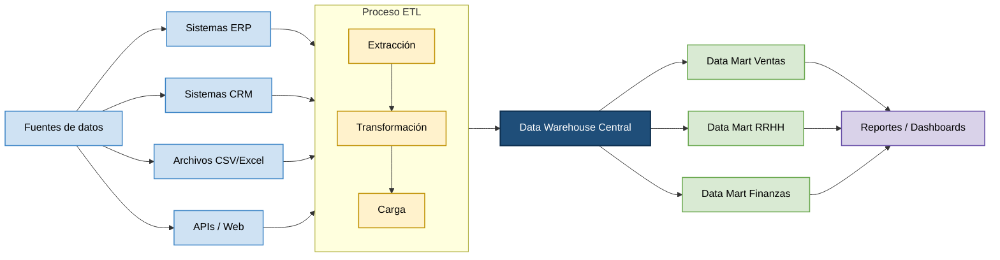
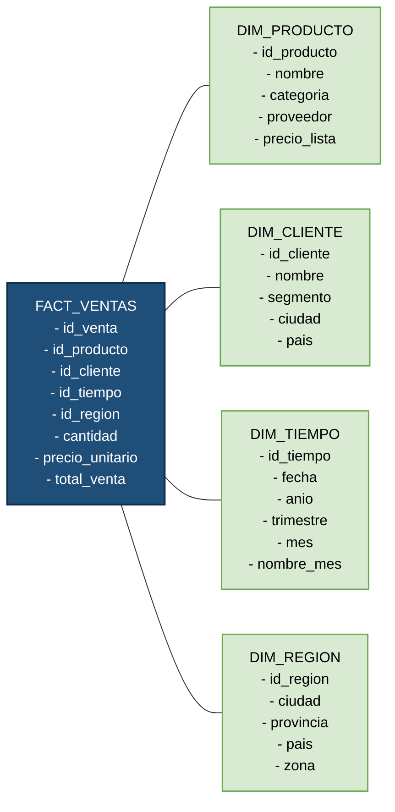

# Bases de Datos para la Toma de Decisiones y Data Warehouse

**Asignatura:** Aplicaciones Web  
**Tema:** Bases de datos para la toma de decisiones y almacenes de datos (Data Warehouse)

---

## 1. Introducción

Las organizaciones modernas generan grandes volúmenes de datos en sus operaciones diarias. Para transformar esos datos en información estratégica, existen dos conceptos fundamentales: las **bases de datos orientadas a la toma de decisiones** y los **Data Warehouses (DW)**. Este resumen recoge definiciones, características y ejemplos provenientes de diversas fuentes bibliográficas.

---

## 2. Ejemplos de Bases de Datos para la Toma de Decisiones

### 2.1 Bases de datos OLAP (Online Analytical Processing)
Las bases de datos OLAP están diseñadas específicamente para el análisis multidimensional de grandes volúmenes de datos históricos. A diferencia de las bases OLTP (transaccionales), permiten consultas complejas de agregación y análisis de tendencias con alta velocidad. Ejemplos de uso:

- **Sector retail:** análisis de ventas por región, período y categoría de producto (Inmon, 2002).
- **Sector bancario:** modelos de riesgo crediticio e indicadores de rentabilidad por segmento de clientes (Kimball & Ross, 2013).
- **Sector salud:** seguimiento de indicadores epidemiológicos y gestión hospitalaria (Turban et al., 2011).

### 2.2 Bases de datos relacionales de soporte a decisiones (DSS)
Los **Sistemas de Soporte a Decisiones (DSS)** utilizan bases de datos relacionales complementadas con modelos analíticos. Según Turban et al. (2011), un DSS combina datos, modelos y herramientas de análisis para asistir a los tomadores de decisiones en problemas semiestructurados y no estructurados.

### 2.3 Bases de datos de minería de datos
Las herramientas de minería de datos (data mining) trabajan sobre bases de datos históricas para descubrir patrones, correlaciones y tendencias. Estas bases alimentan modelos predictivos utilizados en marketing, detección de fraude y análisis de comportamiento del cliente (Han, Kamber & Pei, 2011).

---

## 3. Definiciones de Data Warehouse

| Fuente | Definición |
|--------|-----------|
| **Inmon (2002)** | "Un Data Warehouse es una colección de datos orientados a temas, integrados, no volátiles y variantes en el tiempo, que apoyan las decisiones de la gestión." |
| **Kimball & Ross (2013)** | "Un sistema de almacenamiento de datos que recupera y consolida datos periódicamente de los sistemas fuente en un almacén dimensional o normalizado para el apoyo a decisiones." |
| **IBM (2024)** | "Un Data Warehouse es un repositorio centralizado de información que puede ser analizado para tomar decisiones más informadas." |
| **Turban et al. (2011)** | "Base de datos diseñada para facilitar el análisis y los informes en toda una organización, integrando datos de múltiples fuentes heterogéneas." |

Las cuatro características esenciales propuestas por Inmon se resumen a continuación:

1. **Orientado a temas:** los datos se organizan en torno a temas de negocio (ventas, clientes, productos), no a procesos operativos.
2. **Integrado:** consolida datos de múltiples fuentes, homogeneizando formatos, unidades y convenciones de nombres.
3. **No volátil:** los datos son de solo lectura; una vez cargados no se modifican ni eliminan.
4. **Variante en el tiempo:** almacena datos históricos para análisis de tendencias y comparaciones temporales.

---

## 4. Características de las Bases de Datos para la Toma de Decisiones

| Característica | Descripción |
|----------------|-------------|
| **Orientación analítica** | Diseñadas para consultas de lectura complejas, no para transacciones de escritura intensivas. |
| **Datos históricos** | Almacenan grandes horizontes temporales para detectar tendencias. |
| **Integración de múltiples fuentes** | Consolidan datos de sistemas ERP, CRM, archivos planos, APIs, etc. |
| **Desnormalización** | Se aceptan esquemas estrella o copo de nieve para optimizar el rendimiento de las consultas. |
| **Calidad y consistencia** | Se aplican procesos ETL (Extracción, Transformación y Carga) para garantizar la integridad de los datos. |
| **Escalabilidad** | Capacidad para manejar terabytes de datos y cientos de usuarios concurrentes. |
| **Soporte a consultas ad hoc** | Permiten que analistas construyan consultas sin estructura predefinida. |

---

## 5. Características del Data Warehouse

| Característica | Descripción |
|----------------|-------------|
| **Arquitectura multicapa** | Generalmente compuesta por capa de fuentes, área de staging, DW central y Data Marts. |
| **Proceso ETL** | Extracción, transformación y carga de datos desde sistemas operacionales. |
| **Modelo dimensional** | Uso de tablas de hechos (métricas cuantitativas) y tablas de dimensiones (contexto descriptivo). |
| **Metadatos** | Repositorio de información sobre la estructura, procedencia y definición de los datos. |
| **Rendimiento optimizado** | Índices, particionamiento y materialización de vistas para acelerar consultas. |
| **Consistencia y confiabilidad** | Versión única de la verdad (Single Version of the Truth). |
| **Acceso a herramientas BI** | Se conecta a herramientas de reportería, OLAP y visualización (Power BI, Tableau, etc.). |

---

## 6. Diagrama: Arquitectura de un Data Warehouse

---

## 7. Diagrama: Modelo Estrella (Star Schema) del script SQL

---

## 8. Comparativa: Base de Datos Operacional vs Data Warehouse

| Aspecto | Base de Datos Operacional (OLTP) | Data Warehouse (OLAP) |
|---------|-----------------------------------|-----------------------|
| **Propósito** | Registrar transacciones del negocio | Analizar información para toma de decisiones |
| **Tipo de operaciones** | INSERT, UPDATE, DELETE frecuentes | Principalmente SELECT con grandes agregaciones |
| **Horizonte temporal** | Datos actuales (días/semanas) | Datos históricos (meses/años) |
| **Normalización** | Alta normalización (3FN o superior) | Baja normalización (esquema estrella/copo de nieve) |
| **Usuarios** | Personal operativo (cajeros, agentes) | Analistas, gerentes, directivos |
| **Volumen de datos** | Megabytes a gigabytes | Gigabytes a terabytes |
| **Velocidad de consulta** | Muy rápida para operaciones simples | Optimizada para consultas analíticas complejas |
| **Integridad** | Alta (transacciones ACID) | Consistencia eventual tras ETL |
| **Ejemplo** | Sistema de facturación ERP | Power BI conectado a un DW de ventas |

---

## 9. Referencias Bibliográficas

- Inmon, W. H. (2002). *Building the Data Warehouse* (4th ed.). Wiley.
- Kimball, R., & Ross, M. (2013). *The Data Warehouse Toolkit: The Definitive Guide to Dimensional Modeling* (3rd ed.). Wiley.
- Turban, E., Sharda, R., & Delen, D. (2011). *Decision Support and Business Intelligence Systems* (9th ed.). Pearson.
- Han, J., Kamber, M., & Pei, J. (2011). *Data Mining: Concepts and Techniques* (3rd ed.). Morgan Kaufmann.
- IBM. (2024). *What is a data warehouse?* Recuperado de https://www.ibm.com/topics/data-warehouse
- Oracle. (2024). *What Is a Data Warehouse?* Recuperado de https://www.oracle.com/database/what-is-a-data-warehouse/
- Microsoft. (2024). *Data warehousing in Azure Synapse Analytics*. Recuperado de https://learn.microsoft.com/en-us/azure/synapse-analytics/sql-data-warehouse/sql-data-warehouse-overview-what-is
